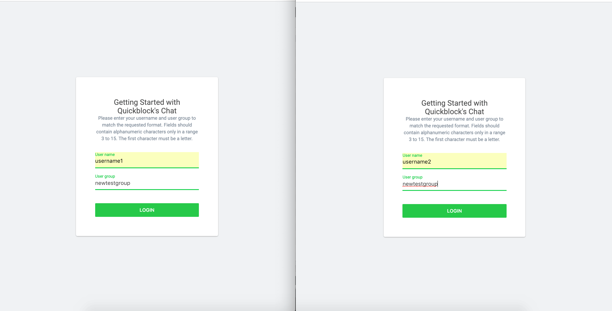

# QuickBlox JavaScript Getting Started Chat Sample

This is a very basic JS application which would be a showcase for 1-1 chat. Code snippets from this sample app would be used in promo article. Existing sample application is too big and can't be used for article. Application should be without any branding or pre-defined credentials.

## Table of Contents
- [Overview](##overview)
- [Lunch App](##lunch-app)
    1. [Configuration File](###configuration-file)
    2. [Running on browser](###running-on-browser)
-[Out of Scope](##out-of-scope)
- [Development Process](#development-process)
    1. [Development Overview](###development-overview)
    3. [Folder Structure](###folder-structure)

## Overview
This sample as said earlier is a  basic sample to showcase for 1-1 chat. The objective of this sample is to prove a point so there will be no unecesary code complexity, libraries etc.

## Lunch App
Runing the app is as simple as running any plain js app, any of the three ways should work like a charm. 

1.  Just opening the `index.html` on a browser should do the trick. 

2.  If you prefer to run it via a server be it local or online, just copy this files to the root folder and access it via 
`http://yourdomain.com` or for secure protocols `https://yourdomain.com` 

3.  If you want to run it in a subdirectory on your server be it local or online, just copy this files to the root folder and access it via `http://yourdomain.com/somedirectory/someotherdirectory` or via secure protocols `https://yourdomain.com/somedirectory/someotherdirectory`

Any of these methods should work fine.

## Out of Scope
The following functionalities are out of the scope of this sample.

- `Design/branding`
- `Mobile responsive design`
- `Project structure`
- `No internet connection behavior`
- `Logging out`
- `Caching data`
- `Attachments`
- `Group chat`
- `Delete chat`
- `History pagination`
- `Block users`
- `Typing status`

 If you desire to see these functionalities in action or how they were implemented please refer to the more [Explicit Version of the Samples](https://github.com/QuickBlox/quickblox-javascript-sdk-internal/tree/gh-pages/samples).  

## Development Process
If you are very concerned with how this sample was developed then this section is for you. Below are the tools used and respective assumptions made which were used to complete this sample.

### Development Overview
Due to the nature of this sample, code complexity has minimized, usage of third part library has been minimized and the use of pure JS to accomplish the basic tasks in the simplest way is emphasize and self explanatory.

### Folder Structure
- root
    - `css/`
    - `js/`
    - `img/ `
    - **index.html**
